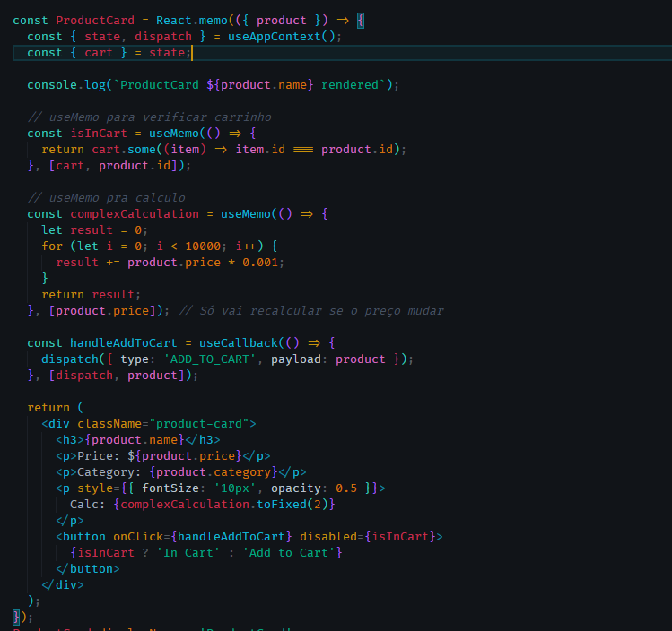
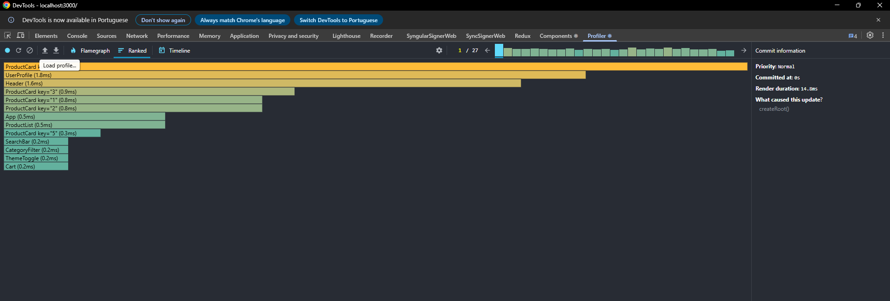
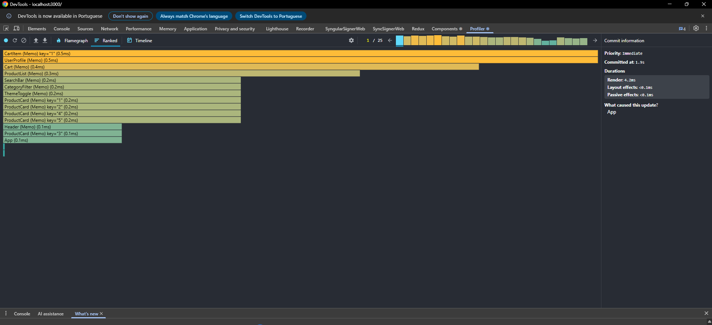

# Performance & State Management Refactor Report Lab 5

## Contexto

A aplicação original usava múltiplos useState e sofria com **prop drilling** (é quando as props são passadas por vários níveis).
Além disso, havia re-renderizações e cálculos desnecessários em vários componentes, afetando o desempenho geral.

---

## Problemas Encontrados

- `CartItem` era re-renderizado quando o **tema** ou **usuário** mudavam, mesmo sem alterar o item.
- `Cart` recalculava o total a cada render.
- `Header` executava uma função pesada em toda renderização.
- Componentes de filtro e busca atualizavam sem necessidade.

---

## Soluções Aplicadas

### Estado Global (Context + useReducer)

- Implementei o **Context** com **useReducer** para centralizar o estado.
- Criei um hook `useAppContext()` para facilitar o acesso.
- Eliminei praticamente todo o o prop drilling.

### Otimizações aplicadas

- `React.memo` em todos os componentes para evitar re-renders desnecessários.
- `useMemo` para cálculos pesados (como total do carrinho, filtragens e estatísticas do usuário).
- `useCallback` para funções de eventos e dispatch.

Exemplo de ação no reducer:

## 

## Benefícios Gerais

- Interface mais rápida e responsiva
- Código limpo e modular
- Estado previsível e fácil de debugar
- Escalável para novas features

---

## Teste das Otimizações

### Problemas de performance antes das otimizações

Antes das otimizações, a aplicação apresentava os seguintes problemas:

- Re-renders excessivos em componentes que não precisavam ser atualizados.
- Cálculos pesados realizados em cada renderização, afetando a responsividade.
- Prop drilling complicado, tornando o código difícil de entender e manter.
  

Escolhi o **Caminho B (Context Avançado)** para a refatoração de estado. Optei por usar Context + useReducer em vez de Redux para manter a solução mais leve, simples e integrada ao React, sem muitas dependências externas.

### Depois das otimizações

Depois das otimizações a aplicação melhorou:

- Redução drástica nos re-renders, com componentes atualizando apenas quando necessário.
- Cálculos pesados foram memoizados, melhorando a performance.
- Código mais limpo e fácil de manter, com estado centralizado.
  
